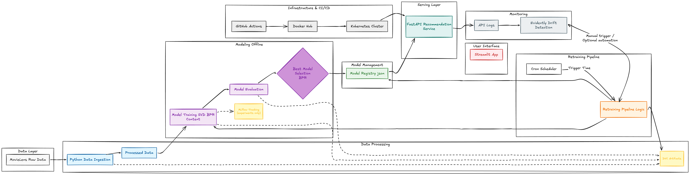
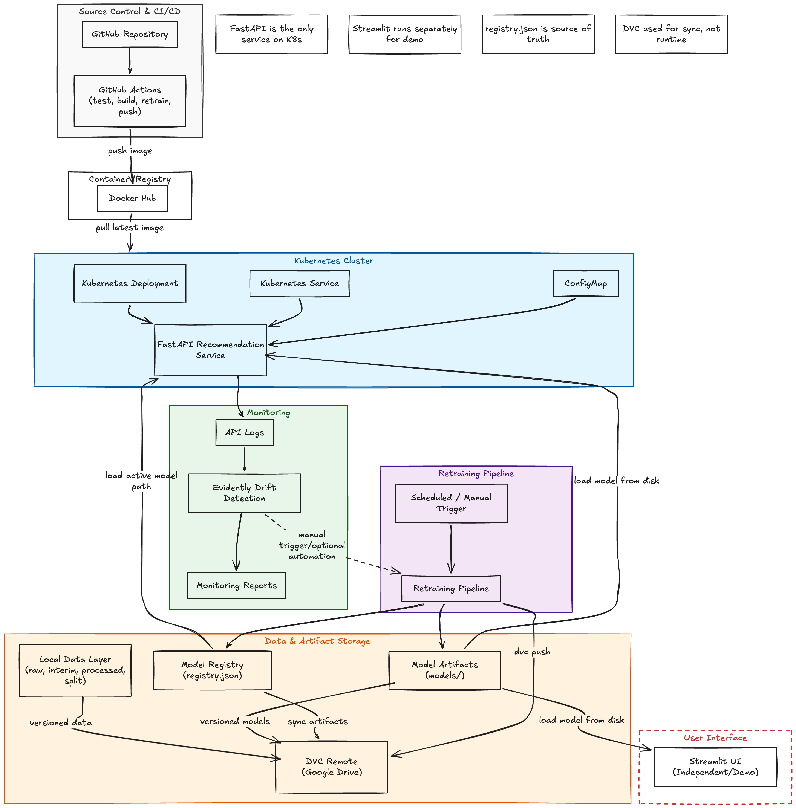

# Movie Recommender System (MLOps)

> **TL;DR / Quick Start**

```bash
git clone <repo>
cd <repo>
uv sync
uv run dvc pull
uv run uvicorn src.serving.app:app --host 0.0.0.0 --port 8000
curl http://127.0.0.1:8000/health
```

---


## Project Structure

```text
├── configs/           # YAML config files (API, data, model, mlflow, etc.)
├── data/
│   ├── raw/           # Raw input data
│   ├── interim/       # Cleaned/intermediate data
│   ├── processed/     # Final processed data
│   └── split/         # Train/val/test splits
├── docs/              # Problem statement, reports, diagrams
├── k8s/               # Kubernetes manifests (local demo)
├── models/
│   ├── baseline/      # Baseline model artifacts
│   ├── personalized/  # Personalized model artifacts (BPR, SVD, etc.)
│   └── registry.json  # Model registry (used by API)
├── notebooks/         # Jupyter notebooks (EDA, experiments)
├── reports/
│   ├── evaluation/    # Evaluation outputs
│   ├── monitoring/    # Monitoring outputs
│   ├── retraining/    # Retraining outputs
│   └── ...            # Other report subfolders
├── scripts/           # Utility scripts (data prep, monitoring logs, etc.)
├── src/
│   ├── data/          # Data ingestion, validation, preprocessing
│   ├── models/        # Model training, benchmarking
│   ├── monitoring/    # Monitoring/reporting code
│   ├── pipeline/      # Retraining pipeline
│   ├── serving/       # FastAPI app, Streamlit UI
└── tests/             # Unit tests
```

---

## System Architecture



## Deployment Architecture



---

## What This Repo Does

- Builds a recommendation pipeline from MovieLens raw data.
- Trains and evaluates Baseline, SVD, BPR, and Content-based models.
- Current selected model: BPR.
- Serves recommendations with FastAPI.
- Supports monitoring, drift checks, retraining, promotion, and rollback.
- Includes optional Streamlit UI for demo.

---

## Prerequisites

- macOS, Linux, or Windows 10/11
- Python 3.10.x (required: `>=3.10,<3.11`)
- `uv` installed
- Git
- Optional: Docker Desktop
- Optional: `make` (for convenience on macOS/Linux)

---

**Note:**  
- This project includes MLflow-based experiment tracking support. MLflow can be used for experiment tracking and registry exploration, but the API serving logic uses `models/registry.json` as the active model registry.
- CI/CD is set up for build/test/image publish, and retraining automation is available, but retraining and deployment are not yet fully chained into a closed automatic production loop.
- Kubernetes manifests are minimal and intended for local demo / coursework deployment.

---

## 1) Clone And Setup (Important)

```bash
git clone <your-repo-url>
cd <repo-folder>
uv sync
```

Sanity check:

```bash
uv run pytest -q
```

Expected: tests pass.

## 2) Configure DVC Access (For Path A)

If your team uses Google Drive as DVC remote, configure credentials once on your machine.

```bash
uv run dvc remote list
uv run dvc config --list
uv run dvc remote modify --local gdrive_remote gdrive_client_id "<YOUR_CLIENT_ID>"
uv run dvc remote modify --local gdrive_remote gdrive_client_secret "<YOUR_CLIENT_SECRET>"
```

Notes:

- `--local` stores credentials in `.dvc/config.local` (git-ignored).
- Do not commit or share client secrets in chat/commit history.

## 3) Choose One Run Path (Choose the right path to avoid errors)

### Path A (Recommended): Run fast with DVC artifacts

Use this path if you want the project running quickly with shared tracked outputs.

```bash
uv run dvc pull
uv run pytest -q
uv run python -m src.models.final_benchmark
```

If `uv run dvc pull` fails with missing remote objects (`missing-files`), switch to Path B and rebuild locally.

Expected outputs:

- `models/personalized/*.pkl`
- `reports/evaluation/final_comparison.md`

### Path B: Full local rebuild from raw data (slower, only use if DVC pull fails)

Use this path if you want to rebuild everything end-to-end yourself.

```bash
uv run python src/data/load_data.py
uv run python src/data/validate_data.py --save-report
uv run python src/data/preprocess.py
uv run python src/data/split.py
uv run python src/models/baseline.py
uv run python src/models/train.py
uv run python src/models/train_bpr.py
uv run python src/models/train_content_based.py
uv run python src/models/evaluate.py
uv run python -m src.models.final_benchmark
uv run pytest -q
```

Expected outputs:

- `data/split/train.parquet`, `data/split/val.parquet`, `data/split/test.parquet`
- `models/baseline/most_popular_items.parquet`
- `models/personalized/svd_model.pkl`
- `models/personalized/bpr_model.pkl`
- `models/personalized/content_based_model.pkl`
- `reports/evaluation/final_comparison.md`

## 4) Run API Locally (Serve recommendation API)

Before starting API, make sure model artifacts exist.

1) Ensure artifacts are available (choose one):

- Path A: `uv run dvc pull`
- Path B: finish full local rebuild steps in Section 3

2) Start API (run from project root, make sure model artifacts exist):

```bash
uv run uvicorn src.serving.app:app --host 0.0.0.0 --port 8000
```


**Note:** If you get errors about missing model/data, make sure you have completed DVC pull or rebuilt data/model as instructed above.

Open interactive API docs in browser:

- Swagger UI: `http://127.0.0.1:8000/docs`
- ReDoc: `http://127.0.0.1:8000/redoc`
- OpenAPI JSON: `http://127.0.0.1:8000/openapi.json`

In another terminal:

```bash
curl http://127.0.0.1:8000/health
curl "http://127.0.0.1:8000/recommend/1?top_k=10"
curl "http://127.0.0.1:8000/recommend/999999?top_k=10"
```

Expected:

- `/health` returns status and active model info.
- `/recommend/{user_id}` returns recommendation list.

## 5) Monitoring And Retraining

Generate monitoring report:

```bash
uv run python -m src.monitoring.report
```

Run retraining flows:

```bash
uv run python -m src.pipeline.retrain_pipeline --strategy schedule
uv run python -m src.pipeline.retrain_pipeline --strategy trigger
uv run python -m src.pipeline.retrain_pipeline --rollback
```

Note: macOS/Linux Makefile shortcuts are available: `make monitoring-report`, `make retrain-weekly`, `make retrain-trigger`, `make retrain-rollback`.

Expected outputs:

- `reports/monitoring/monitoring_report.md`
- `reports/retraining/retrain_report.md`

## 6) Docker (Optional)

```bash
docker build -t movielens-api .
docker run --rm -p 8000:8000 movielens-api
```

In another terminal:

```bash
curl http://127.0.0.1:8000/health
curl "http://127.0.0.1:8000/recommend/1?top_k=10"
```

Note: first Docker build can be slow due to dependency download.

## 7) Kubernetes Deployment

This project includes minimal Kubernetes manifests for deploying the recommender API service.

Files:

- `k8s/deployment.yaml`
- `k8s/service.yaml`
- `k8s/configmap.yaml`
- `k8s/secret.example.yaml`

Prerequisites:

- Docker
- `kubectl`
- A running local cluster (`minikube`, `kind`, or `k3d`)

Build image:

```bash
docker build -t movielens-api:latest .
```

If you use minikube, load image into the cluster runtime:

```bash
minikube image load movielens-api:latest
```

Apply manifests:

```bash
kubectl apply -f k8s/
```

Check status:

```bash
kubectl get pods
kubectl get svc
```


### Expose API for demo (port-forward or NodePort)

**Option 1: Port-forward (simple, safe):**

```bash
kubectl port-forward svc/recommender-service 8000:80
```


**Option 2: Change to NodePort (if you need to access from outside the cluster):**
Edit service.yaml:
```yaml
type: NodePort
```
Then get the nodePort and access via the node's IP.

### Demo: Scale deployment (K8s best practice)
```bash
kubectl scale deployment recommender-api --replicas=4
kubectl get pods
```
You will see multiple recommender-api pods running in parallel.

```bash
curl http://127.0.0.1:8000/health
curl "http://127.0.0.1:8000/recommend/1?top_k=10"
```

Cleanup:

```bash
kubectl delete -f k8s/
```


## 8) Streamlit UI (BPR Recommendations)

You can run a lightweight UI to get personalized movie recommendations for a user using the BPR model.

Prerequisites:

- Model bundle exists at `models/personalized/bpr_model.pkl`

Run UI (make sure the BPR model bundle exists):

```bash
uv run streamlit run src/serving/ui_app.py
```

Note: macOS/Linux shortcut: `make ui-run`.

Then open the local Streamlit URL shown in terminal (usually `http://localhost:8501`).

## 9) CI/CD Overview

- CI: `.github/workflows/ci.yml` runs dependency install, smoke compile checks, and unit tests.
- CD: `.github/workflows/cd.yml` builds and publishes API Docker image to GHCR on push to `main` (or manually via workflow dispatch).
- Retraining automation: `.github/workflows/retrain.yml` for retrain-related workflow steps.

## DVC Workflow (Team Use)

Pull shared outputs:

```bash
uv run dvc pull
```

If you changed tracked pipeline outputs:

```bash
uv run dvc repro
uv run dvc push
git add dvc.yaml dvc.lock
git commit -m "chore: update dvc pipeline metadata"
```

Check remote/config:

```bash
uv run dvc remote list
uv run dvc config --list
```
## 10) MLflow Tracking & Model Registry

This project uses [MLflow](https://mlflow.org/) for experiment tracking and model registry.

### Start MLflow UI

From the project root (where the `mlruns` folder is located), run:

```bash
mlflow ui
```

By default, the UI will be available at [http://localhost:5000](http://localhost:5000).

### View Experiments & Runs

- Select the experiment (e.g., `movie-recommender-bpr`) in the left sidebar.
- You can compare runs, view parameters, metrics, and artifacts for each training run.

### Model Registry

- Click the "Models" tab in the MLflow UI to see all registered models (e.g., `BPR_Recommender`).
- You can view model versions, download artifacts, and manage model stages (Staging, Production, Archived).

### Notes

- The tracking URI and experiment name are configured in `configs/mlflow.yaml`.
- Make sure to run `mlflow ui` from the same directory as your `mlruns` folder to see all runs.
- If you use a remote MLflow server, update the `tracking_uri` accordingly.


---
## ⚠️ Common Issues & Troubleshooting

- **Missing model/data error:** Run DVC pull or rebuild data/model as instructed above.
- **Permission error with Docker/K8s:** Try running as admin/sudo or check that Docker Desktop is running.
- **Cannot access API:** Check port-forward or NodePort, make sure manifests are applied and pods are running.
- **API/UI errors:** Ensure correct Python version and all dependencies installed with `uv sync`.